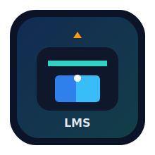

# Learning Management System (LMS)

<p align="center">
  
</p>

<p align="center">
  
  
  
  
  
</p>

A complete web-based LMS where students can enroll in courses, watch ordered lessons, and track progress, while admins manage their own course content.

## ✨ Highlights

- Student and Admin authentication
- Admin signup secret code: ADMIN2026
- Role-based access control
- Course creation and lesson management
- Strict lesson ordering (unlock next lesson after completing previous)
- Progress tracking per course
- Admin course ownership (each admin can manage only their own courses)
- Modern responsive UI with toast notifications

## 🧱 Tech Stack

- Backend: Python, Flask
- Database: SQLite (local), PostgreSQL (production-ready via DATABASE_URL)
- ORM: SQLAlchemy (Flask-SQLAlchemy)
- Auth: JWT (PyJWT)
- Frontend: HTML, CSS, JavaScript

## 📁 Project Structure

```text
Learning_Management_System/
├── backend/
│   ├── app.py
│   ├── database.py
│   ├── models.py
│   ├── routes/
│   │   └── api.py
│   └── services/
│       └── auth_service.py
├── frontend/
│   ├── index.html
│   ├── login.html
│   ├── signup.html
│   ├── dashboard.html
│   ├── course.html
│   └── lesson.html
├── static/
│   ├── css/
│   │   └── style.css
│   ├── js/
│   │   └── app.js
│   └── img/
│       └── lms-logo.svg
├── database/
│   └── lms.db
├── requirements.txt
└── README.md
```

## 🚀 Quick Start (Windows PowerShell)

### 1. Clone and move into folder

```powershell
git clone <your-repo-url>
cd Learning_Management_System
```

### 2. Create virtual environment (if needed)

```powershell
python -m venv .venv
.\.venv\Scripts\Activate.ps1
```

### 3. Install dependencies

```powershell
pip install -r requirements.txt
```

### 3.1 Create local environment file (recommended)

```powershell
Copy-Item .env.example .env
```

Then edit `.env` and set your own `SECRET_KEY`.

### 4. Run the app

```powershell
.\.venv\Scripts\python.exe backend\app.py
```

### 5. Open in browser

- http://127.0.0.1:5000

## 🔐 Authentication Notes

- Student signup endpoint: POST /api/signup/student
- Admin signup endpoint: POST /api/signup/admin
- Admin signup requires:
  - admin_code = ADMIN2026

## 👤 Admin Ownership Rule

Courses are linked to the admin who created them.

- Admin A can create/edit/delete only Admin A courses
- Admin B cannot manage Admin A courses
- Admin dashboard shows only that admin's own courses

## 📚 Core API Endpoints

### Auth

- POST /api/signup/student
- POST /api/signup/admin
- POST /api/login
- POST /api/logout

### Courses

- GET /api/courses
- GET /api/course/<id>
- POST /api/course (admin)
- PUT /api/course/<id> (owner admin)
- DELETE /api/course/<id> (owner admin)

### Lessons

- GET /api/course/<id>/lessons
- POST /api/lesson (owner admin)
- PUT /api/lesson/<id> (owner admin)
- DELETE /api/lesson/<id> (owner admin)

### Enrollment & Progress

- POST /api/enroll
- GET /api/my-courses
- POST /api/lesson/complete
- GET /api/course-progress/<course_id>

## 🖥️ UI Pages

- /index.html
- /signup.html
- /login.html
- /dashboard.html
- /course.html?id=<course_id>
- /lesson.html?id=<lesson_id>&course=<course_id>

## 🧪 Example Admin Workflow

1. Signup as admin with secret code ADMIN2026
2. Login
3. Create a course from Admin Panel
4. Add lessons with YouTube embed links
5. Verify students can enroll and complete lessons in order

## 🛠️ Troubleshooting

### App does not start from VS Code Run button

Use the same interpreter as your virtual environment:

```powershell
.\.venv\Scripts\python.exe backend\app.py
```

### Module not found errors

Reinstall requirements in active environment:

```powershell
pip install -r requirements.txt
```

## 🌐 Publish to GitHub

Use these commands from project root:

```powershell
git init
git add .
git commit -m "Initial commit: Learning Management System"
git branch -M main
git remote add origin https://github.com/<your-username>/<your-repo>.git
git push -u origin main
```

If you already created a remote and get an error, verify remotes with:

```powershell
git remote -v
```

## 📌 Future Improvements

- Quiz and assignments
- Certificates
- Discussion forums
- Analytics dashboard enhancements
- Better deployment pipeline (CI/CD)

---

Built for learning and experimentation with full-stack web development.
